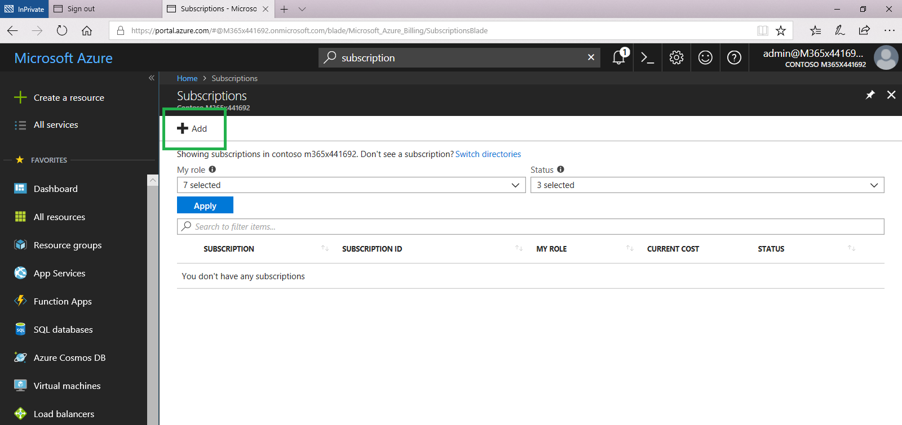
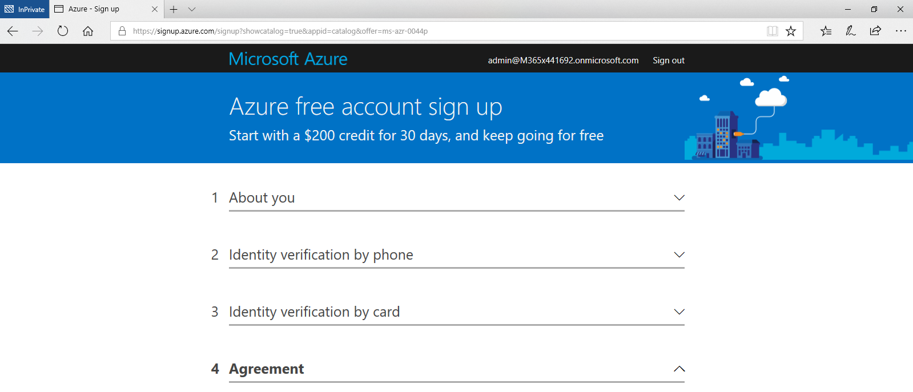
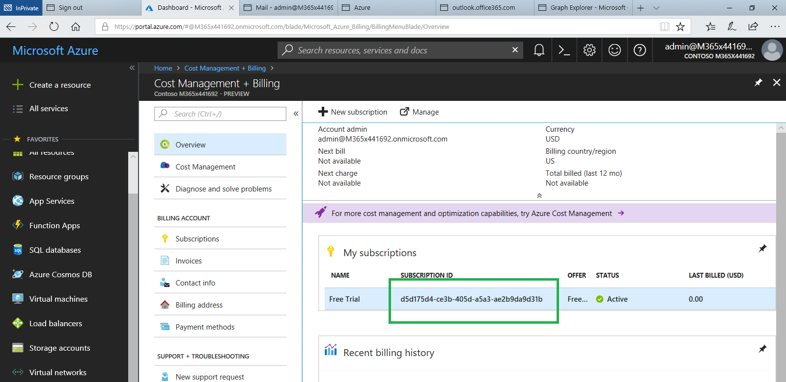
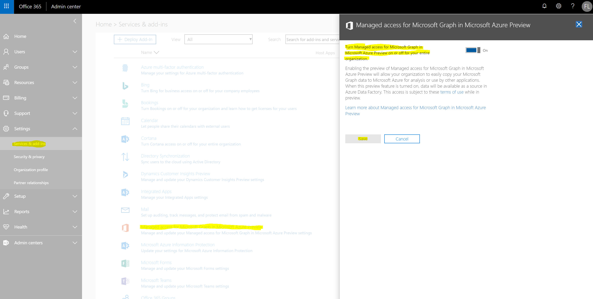

# Onboarding to private preview

To start prototyping you need to first onboard a test office tenant and an azure subscription

## Onboarding steps

1. Create an enterprise tenant at <https://demos.microsoft.com>. Sign in with your account that is registered as a Microsoft Partner.
2. Log in with that demo admin account at <https://portal.azure.com>.
3. Open the Subscriptions blade. Select Add.



4. Go through the steps to create a subscription.



5. Open the Cost Management + Billing to get the subscription ID.



6. Open the Azure Active Directory blade.
7. Under Managed, select Properties. The tenant ID that we need is the Directory ID.


8. Send us the Subscription ID from step 5 and the Directory ID from step 7.

9. The features will be enabled in 1-2 weeks and you will receive a communication from us about the same.

------

Once you receive communication from us, you need to turn on couple of knobs.

## Tenant Opt-in
1. Go to <https://www.office.com/> and sign in using tenant admin credential.
2. Select "Admin" app from Apps panel.
3. On the left side menu, go to settings -> ServicesAndAddIns option.
4. Select "Managed access for Microsoft Graph in Microsoft Azure Preview" Add-In from options. If you don’t see "Managed access for Microsoft Graph in Microsoft Azure Preview" in the list, please contact us.
5. Click on "Turn O365 Data Plan Preview on or off" toggle to enable it.
6. Click on "Save" button in the end.

Use below screenshot to understand the layout:


------

## Enabling Tenant Lockbox

1. Use IE for this step. Download the Microsoft Exchange Online PowerShell module following [these instructions](https://technet.microsoft.com/en-us/library/mt775114(v=exchg.160).aspx)

2. Open the installed Microsoft Exchange Online PowerShell module.

3. Login:

```powershell
Connect-EXOPSSession
```

4. You will have to set up an approver group as part of the flow, with **at least two** members in the group to approve tenant lockbox requests. More info on the command is available [here](https://docs.microsoft.com/en-us/powershell/module/exchange/users-and-groups/new-distributiongroup?view=exchange-ps). 

```powershell
New-DistributionGroup -Name "TenantLockboxApprovers" -Members "chris@contoso.com,michelle@contoso.com,laura@contoso.com,julia@contoso.com"
```

5. Turn on Tenant Lockbox.
>**NOTE:** "TenantLockboxApprovers" in the below command refers to the name of approver group created in step 4.

```powershell
Enable-ElevatedAccessControl -AdminGroup "TenantLockboxApprovers" -SystemAccounts @()
```

------

