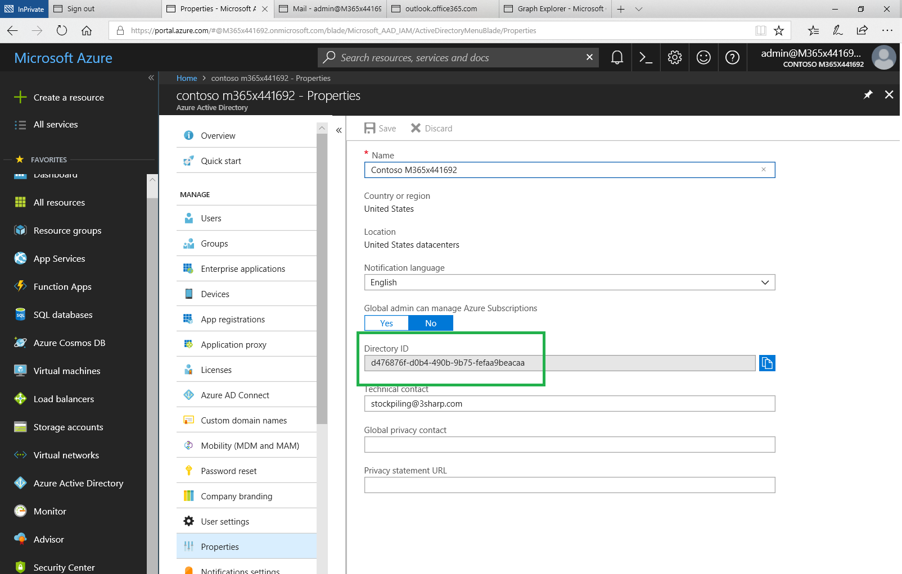

# Onboarding to private preview

To start prototyping you need to first onboard a test office tenant and an azure subscription

## Onboarding steps

1. Create an enterprise tenant at <https://demos.microsoft.com>. Sign in with your account that is registered as a Microsoft Partner.
2. Log in with that demo admin account at <https://portal.azure.com>.
3. Open the Subscriptions blade. Select Add.


4. Go through the steps to create a subscription.


5. Open the Cost Management + Billing to get the subscription ID.


6. Open the Azure Active Directory blade.
7. Under Managed, select Properties. The tenant ID that we need is the Directory ID.



8. Send us the Subscription ID from step 5 and the Directory ID from step 7.

9. The features will be enabled in 1-2 weeks and you will receive a communication from us about the same.

10. **After** you receive a communication from us, you need to setup Managed Access. For security reasons, your copy activity won't have access to Office 365 data until *after* setting up Managed Access.

------

## Setup Managed Access (Required)

### Before using Office 365 data, an Office 365 Admin must take 2 actions:
1. Give consent for copying data from Office 365 to Azure (i.e. keep full control over the data, but allow Azure resources to access it)
2. Set an approver group within the Office 365 subscription. The approver group will be tasked with approving specific requests for access to data.

```
Privileged Access Management (PAM) allows for granular access control over privileged tasks in Office 365.
Users can request highly scoped and time bound Just-In-Time (JIT) access to privileged tasks.
This gives users Just Enough Access (JEA) to perform the task at hand.
```

To do this, an admin must
```
You must be added to the private preview list before completing these steps.
```
1. Go to https://portal.office.com/adminportal/home#/groups
1. Click "Add a group"
1. Select "Mail-enabled security"
1. Enter a name for the group (E.g. Privileged Access Management approver group)
1. Enter a email address for the group (E.g. approvers@contoso.com)
1. Click "Save"
1. Go to https://portal.office.com/adminportal/home#/Settings/ServicesAndAddIns
1. Open "Managed access for Microsoft Graph in Microsoft Azure Preview" (If you don’t see "Managed access for Microsoft Graph in Microsoft Azure Preview" in the list, please contact us.)
1. Flip the switch to "On"
1. Enter a mail enabled security group (E.g. approvers@contoso.com) under "Group of users to make approval decisions"
1. Click "Save"
1. Wait until the settings update confirmation message is displayed (E.g. "Managed access for Microsoft Graph in Microsoft Azure Preview settings have been updated.")

Here are images of the user interface:


